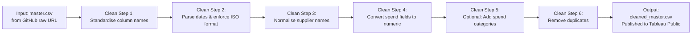

# Newcastle City Council – Payments Over £250  
### Automated Open‑Data Pipeline & Public Dashboard

This repository contains an automated, reproducible pipeline that collects, cleans, and publishes Newcastle City Council’s **Payments Over £250** dataset for public transparency and analysis.

The goal is to provide a **single, consistent, machine‑readable dataset** that updates automatically every month and powers a **public Tableau dashboard**.

---

## 📌 Overview

Newcastle City Council publishes monthly CSV files showing all payments over £250.  
However:

- File naming is inconsistent  
- Links change format  
- Data is spread across many CSVs  
- No consolidated dataset exists  

This project solves that by:

1. **Scraping** the council’s landing page for all CSV links  
2. **Normalising** filenames into `YYYY-MM.csv`  
3. **Downloading** only new months  
4. **Merging** all raw CSVs into a single master dataset  
5. **Publishing** the cleaned dataset for public use  
6. **Feeding** a Tableau Public dashboard

All updates run automatically via GitHub Actions.

---

## 🗂 Repository Structure

```
ncc-analysis/
│
├── data/
│   ├── raw/                 # Monthly CSVs (YYYY-MM.csv)
│   └── processed/
│       └── master.csv       # Combined dataset
│
├── scripts/
│   ├── download_latest.py   # Scraper for CSV links
│   └── merge.py             # Combines all raw CSVs
│
└── .github/
└── workflows/
└── update.yml       # Monthly automation
```

---

## ⚙️ Automation

A GitHub Actions workflow runs on the **5th of every month**:

- Fetches the landing page  
- Extracts all CSV links  
- Downloads any new files  
- Merges all data  
- Commits updates back to the repository  

This ensures the dataset is always current.

---

<!-- ## 🧼 Data Cleaning (Tableau Prep)

A Tableau Prep flow performs:

- Column name normalisation  
- Date parsing  
- Supplier name cleaning  
- Spend categorisation (optional)  
- Duplicate removal  
- Output to Tableau Public  

See the diagram below for the flow structure.

---

## 📊 Public Dashboard

A Tableau Public dashboard visualises:

- Spend over time  
- Spend by service area  
- Supplier breakdown  
- Category treemaps  
- Monthly trends  

(Will insert Tableau Public link here once published.)

--- -->

## 📥 Data Sources

All data originates from:

**Newcastle City Council – Payments Over £250**  
https://www.newcastle.gov.uk/local-government/access-information-and-data/open-data/payments-over-ps250-data-sets

---

## 📝 License

This project republishes public sector information under the UK Open Government Licence (OGL).

---

## 🤝 Contributing

Pull requests are welcome for:

- Improved cleaning logic  
- Additional datasets  
- Better categorisation  
- Dashboard enhancements  

---

## 📬 Contact

For questions or suggestions, please open an issue in this repository.


## Tableau Prep Flow Diagram

